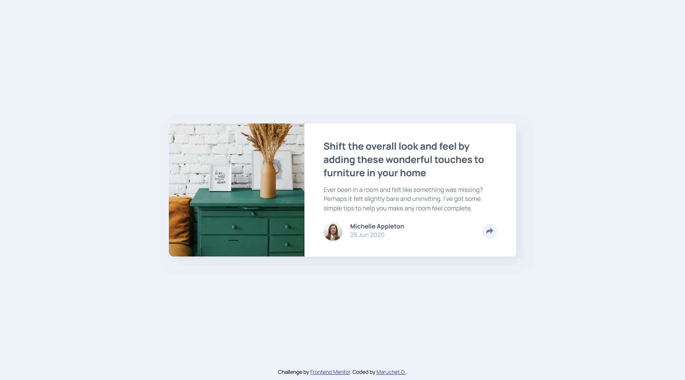

# Frontend Mentor - Article preview component solution

This is a solution to the [Article preview component challenge on Frontend Mentor](https://www.frontendmentor.io/challenges/article-preview-component-dYBN_pYFT). Frontend Mentor challenges help you improve your coding skills by building realistic projects.

## Table of contents

- [Overview](#overview)
  - [The challenge](#the-challenge)
  - [Screenshot](#screenshot)
  - [Links](#links)
- [My process](#my-process)
  - [Built with](#built-with)
  - [What I learned](#what-i-learned)
- [Author](#author)

## Overview

### The challenge

Users should be able to:

- View the optimal layout for the component depending on their device's screen size
- See the social media share links when they click the share icon

### Screenshot



### Links

- Solution URL: [Add solution URL here](https://your-solution-url.com)
- Live Site URL: [Add live site URL here](https://your-live-site-url.com)

## My process

### Built with

- Semantic HTML5 markup
- CSS custom properties
- Flexbox
- Mobile-first workflow

### What I learned

```css
/* Popup arrow - https://www.w3schools.com/howto/howto_js_popup.asp */
.share-popup::after {
  content: " ";
  position: absolute;
  top: 100%;
  left: 50%;
  margin-left: -10px;
  border-width: 10px;
  border-style: solid;
  border-color: var(--VeryDarkGrayishBlue) transparent transparent transparent;
}
```

```js
document.querySelector(".js-popup").addEventListener("click", () => {
  const popup = document.querySelector(".js-popup-container");

  if (popup.style.display === "block") {
    popup.style.display = "none";
  } else {
    popup.style.display = "block";
  }

  document
    .querySelector(".js-share-icon")
    .classList.toggle("change-share-icon");
});
```

If you want more help with writing markdown, we'd recommend checking out [The Markdown Guide](https://www.markdownguide.org/) to learn more.


## Author

- Frontend Mentor - [@MaruchetO](https://www.frontendmentor.io/profile/MaruchetO)
